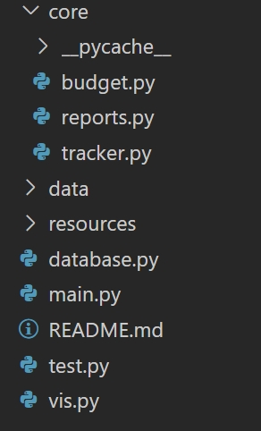
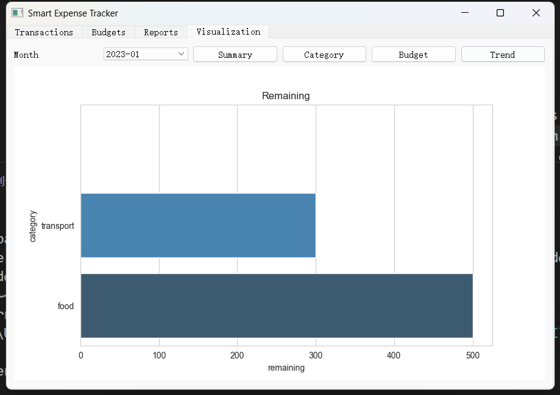

# How to Use AI - Demo (All in English)

## 1. Setup

> 🎯 Goal: Let students run ChatGPT-generated Python code locally.

### Install VS Code

* Download: [https://code.visualstudio.com/](https://code.visualstudio.com/)
* Install the Python extension
* Open Terminal (Windows: Ctrl+`, Mac: Cmd+`)

### Install Python

* Download: [https://www.python.org/downloads/](https://www.python.org/downloads/)

* Make sure to check "Add Python to PATH"

* Verify installation:

  ```bash
  python --version
  ```

### Run Your First Python Program

1. Open VS Code, create a new file `hello.py`

2. Enter:

   ```python
   print("Hello, world!")
   ```

3. In terminal:

   ```bash
   python hello.py
   ```

4. You should see: `Hello, world!`

## 2. Project Overview

ðŸ› ï¸ This project demonstrates how to use **AI** to build and assemble code for a desktop "Expense Tracker" with:

- expense/income recording  
- budget reminders  
- report generation & export  
- data visualization  
- GUI  

You’ll learn:

- How to design effective prompts to generate backend logic  
- How to interpret and test AI outputs 
- How to integrate **pandas** and **matplotlib** for data analysis & visualization
- How to connect Python backend with GUI
- How to iterate and debug collaboratively with AI  

## 3. Specific design

###  â‘  Frame Construction

A solid directory scaffold makes all future development smoother. The core job now is to ask the AI to turn that into a folder/file skeleton.  

But how to ask efficiently? 

**âŒBad Prompt**

> Generate a project directory structure for a smart expense tool with features: recording, reminders, reports, visualization, GUI.

Issues:

- No tech stack or language → AI might pick JavaScript, Java, etc.
- No concrete file/folder names → unpredictable output.
- No format specification → AI may return plain text, bullet list, or paragraph.

So we should identify prompt elements first.

1. **Context/Tech Stack** - Python, SQLite, pandas, matplotlib, etc.  
2. **Requirements** - List of files/folders that implement each feature  
3. **Output Format** - Markdown fenced code block, tree-view

##### ✅ Good Prompt

> I’m building a “Expense Tracker†app using Python, SQLite, pandas, matplotlib, ect.
> It needs to support:
>
>        1. expense/income recording
>           2. budget reminders
>              3. report generation & export
>              4. data visualization
>              5. GUI
>
> Please propose an initial project directory structure:
>
>   - Include clear Python file and folder names
>   - Provide a one-line description for each item
>   - Output it as a Markdown fenced code block in a tree-view format

**Outcome**

```markdown
expense_tracker/
├── main.py                    # App entry point (launches GUI)
├── database.py               # All database operations (models + queries)
├── config.py                 # Constants (DB path, budget limits, etc.)
│
├── core/                     # Core functionality
│   ├── tracker.py           # CRUD for income/expense records
│   ├── budget.py            # Budget calculations & alerts
│   └── reports.py           # Report/visualization generation
│
├── gui/                      # User interface
│   ├── main_window.py       # Main window layout (Tkinter/PyQt)
│   └── components.py        # Reusable UI widgets (tables, charts, etc.)
│
└── data/
    ├── expenses.db          # SQLite database file
    └── exports/             # Generated reports/charts
```

Build the project according to the framework and personalize it appropriately.



### â‘¡ Code implementation

#### 1. Database

**Prompt**

> I’m building a “Smart Expense Tracker†desktop app in Python, and I want to use **pure pandas DataFrame** operations (no raw SQL) to create and manage my SQLite database. Please generate a Python module named `database.py`.
>
> Wrap your answer in a single `database.py` code block.

<details>
<summary><strong>Reference Code (Generated by AI)</strong></summary>

```python
import sqlite3
import pandas as pd
from pathlib import Path
from typing import Optional, Union

class ExpenseDatabase:
    def __init__(self, db_path: str = "resources/data.db"):
        self.db_path = Path(db_path)
        self.db_path.parent.mkdir(parents=True, exist_ok=True)
        self._init_db()

    def _get_conn(self) -> sqlite3.Connection:
        return sqlite3.connect(self.db_path)

    def _init_db(self) -> None:
        with self._get_conn() as conn:
            conn.execute("""
                CREATE TABLE IF NOT EXISTS transactions (
                    id INTEGER PRIMARY KEY AUTOINCREMENT,
                    date TEXT NOT NULL,
                    amount REAL NOT NULL,
                    category TEXT NOT NULL,
                    description TEXT,
                    type TEXT CHECK(type IN ('income','expense'))
                )
            """)
            conn.execute("""
                CREATE TABLE IF NOT EXISTS budgets (
                    category TEXT PRIMARY KEY,
                    monthly_limit REAL NOT NULL
                )
            """)

    def add_transaction(self, data: Union[dict, pd.DataFrame]) -> None:
        if isinstance(data, dict):
            df = pd.DataFrame([data])
        elif isinstance(data, pd.Series):
            df = data.to_frame().T
        else:
            df = data.copy()
        for col in ("date","amount","category","description","type"):
            if col not in df.columns:
                df[col] = "" if col=="description" else None
        df = df[["date","amount","category","description","type"]]
        with self._get_conn() as conn:
            df.to_sql("transactions", conn, if_exists="append", index=False)

    def get_transactions(self,
                         start_date: Optional[str]=None,
                         end_date:   Optional[str]=None
                        ) -> pd.DataFrame:
        sql = "SELECT * FROM transactions"
        params = []
        if start_date or end_date:
            cond = []
            if start_date:
                cond.append("date>=?"); params.append(start_date)
            if end_date:
                cond.append("date<=?"); params.append(end_date)
            sql += " WHERE " + " AND ".join(cond)
        with self._get_conn() as conn:
            return pd.read_sql(sql, conn, params=params or None, parse_dates=["date"])

    def set_budget(self, category: str, limit: float) -> None:
        with self._get_conn() as conn:
            conn.execute("""
                INSERT INTO budgets(category, monthly_limit)
                VALUES(?,?)
                ON CONFLICT(category) DO UPDATE
                  SET monthly_limit = excluded.monthly_limit
            """, (category, limit))

    def get_budgets(self) -> pd.DataFrame:
        with self._get_conn() as conn:
            return pd.read_sql("SELECT category, monthly_limit FROM budgets", conn)

    def get_spending_summary(self) -> pd.DataFrame:
        with self._get_conn() as conn:
            spending = pd.read_sql(
                "SELECT category, SUM(amount) AS expense "
                "FROM transactions WHERE type='expense' GROUP BY category",
                conn
            )
            budgets = pd.read_sql("SELECT category, monthly_limit FROM budgets", conn)
        merged = pd.merge(budgets, spending, on="category", how="left").fillna(0)
        merged["remaining"] = merged["monthly_limit"] + merged["expense"]
        return merged[["category","expense","monthly_limit","remaining"]]

    def export_to_csv(self, filepath: str) -> None:
        df = self.get_transactions().drop(columns=["description"])  # drop empty column
        out = Path(filepath)
        out.parent.mkdir(parents=True, exist_ok=True)
        df.to_csv(out, index=False)
```
</details>

**Goal**

- Understand the contents of this table.
- Find the address where data is saved.

#### 2. core/tracker.py

**Prompt**

>  The database module (database.py) is done. Write `core/tracker.py` with these functions:
>
>  1. add_expense
>  2. add_income
>  3. remove_entry (Deletes the row from `transactions` table by id)
>  4. list_entries (Returns a DataFrame of the filtered rows)
>
>  Constraints: 
>
>  • Import only from `database` and `pandas`
>
>  • Use type hints and simple docstrings 
>
>  • Keep each function under ~15 lines
>
>  Format:  
>
>  • Wrap your answer in a complete `core/tracker.py` code block 

<details>
<summary><code>core/tracker.py</code></summary>

```python
from typing import Optional
import pandas as pd
import sqlite3
from database import ExpenseDatabase

db = ExpenseDatabase()

def add_expense(date: str, amount: float, category: str, description: str) -> int:
    """Add an expense transaction and return its ID."""
    data = {
        "date": date,
        "amount": -abs(float(amount)),
        "category": category,
        "description": description,
        "type": "expense"
    }
    db.add_transaction(data)
    return _get_last_id()

def add_income(date: str, amount: float, category: str, description: str) -> int:
    """Add an income transaction and return its ID."""
    data = {
        "date": date,
        "amount": abs(float(amount)),
        "category": category,
        "description": description,
        "type": "income"
    }
    db.add_transaction(data)
    return _get_last_id()

def remove_transaction(tx_id: int) -> bool:
    """Remove a transaction by ID."""
    with sqlite3.connect(db.db_path) as conn:
        return conn.execute(
            "DELETE FROM transactions WHERE id = ?", (tx_id,)
        ).rowcount > 0

def get_transactions(
    start_date: Optional[str] = None,
    end_date: Optional[str] = None,
    category: Optional[str] = None
) -> pd.DataFrame:
    """Retrieve transactions with optional filters."""
    df = db.get_transactions(start_date, end_date)
    return df[df["category"] == category] if category else df

def _get_last_id() -> int:
    """Internal helper to get last inserted ID."""
    with sqlite3.connect(db.db_path) as conn:
        return conn.execute("SELECT last_insert_rowid()").fetchone()[0]
```
</details>

Now we need to make sure that the code works properly. Therefore, it is necessary now to make a prompt that asks ChatGPT to generate a comprehensive test script.

> I have two modules:     
>
> - database.py defines ExpenseDatabase     
> - core/tracker.py defines add_expense, add_income, list_entries, remove_entry
>
> Please generate a file named `test.py` that:
>
> - Create an ExpenseDatabase instance.      
> - Add two transactions (one expense, one income).   
> - Query all transactions.
> - Set budgets for [Catagory1] and [Catagory2]and print budgets.       
> - Print spending summary and alert.
> - Export all transactions to `data/transactions_export.csv` and print confirmation.

<details>
<summary><strong>Reference Code</strong></summary>

```python
from database import ExpenseDatabase
import pandas as pd
from pathlib import Path

def print_table(df: pd.DataFrame, title: str) -> None:
    print(f"\n=== {title} ===")
    if df.empty:
        print("No data")
    else:
        print(df.to_string(index=False))

def test_database() -> None:
    print("=== Expense Database Test ===")
    db = ExpenseDatabase()

    # 1. Add sample transactions
    print("\n1. Adding Transactions...")
    samples = [
        {"date":"2023-01-10","amount":-150.0,"category":"food","type":"expense"},
        {"date":"2023-01-15","amount":5000.0,"category":"salary","type":"income"},
        {"date":"2023-01-20","amount":-200.0,"category":"transport","type":"expense"}
    ]
    for t in samples:
        db.add_transaction(t)
    print_table(db.get_transactions(), "All Transactions")

    # 2. Set budgets
    print("\n2. Setting Budgets...")
    db.set_budget("food",500.0)
    db.set_budget("transport",300.0)
    print_table(db.get_budgets(), "Current Budgets")

    # 3. Spending summary
    print("\n3. Spending Summary:")
    summary = db.get_spending_summary()
    print_table(summary, "Detailed Summary")

    # 4. Export
    print("\n4. Exporting data...")
    export_path = "data/transactions.csv"
    db.export_to_csv(export_path)
    print(f"Data exported to {export_path}")

if __name__ == "__main__":
    # ensure data folder exists
    Path("data").mkdir(exist_ok=True)
    test_database()
    print("\nAll tests completed!")
```
</details>

**Goal**

- Able to understand and modify error reporting with AI.

  Hint1: You need to delete the original `data.db` if you modify `database.py`.

  Hint2: Missing some libraries can lead to compilation errors. (You May need use `pip` to install them.)

- Judge the correctness of the test.

  Hint: Judging whether the answer is correct by calculation.

- Ability to optimize code (e.g. reduce redundancy in fields)

  Hint: If you can't understand the modified code fragment well, you can try to ask AI to give the complete code.

The test reference is shown in the figure.


#### 3.core/budget.py & reports.py

Try to use your own words to prompt AI and test the codes. Here are reference codes.

<details>
<summary><code>core/budget.py</code></summary>

```python
import sqlite3
import pandas as pd
from typing import Tuple
from database import ExpenseDatabase

db = ExpenseDatabase()

def set_category_budget(category: str, limit: float) -> None:
    """
    Set or update the monthly budget for a category.
    """
    db.set_budget(category, limit)

def get_category_budget(category: str) -> float:
    """
    Return the monthly_limit for the given category, or 0.0 if not defined.
    """
    budgets = db.get_budgets()
    row = budgets[budgets["category"] == category]
    return float(row["monthly_limit"].iloc[0]) if not row.empty else 0.0

def remove_category_budget(category: str) -> bool:
    """
    Remove a budget entry by category. Return True if deleted.
    """
    conn = sqlite3.connect(db.db_path)
    cur = conn.cursor()
    cur.execute("DELETE FROM budgets WHERE category = ?", (category,))
    conn.commit()
    deleted = cur.rowcount > 0
    conn.close()
    return deleted

def list_budgets() -> pd.DataFrame:
    """
    Return all budget entries as a DataFrame.
    """
    return db.get_budgets()

def check_budget(category: str) -> Tuple[bool, float]:
    """
    Check if a category is over its budget.
    Returns (is_over_budget, remaining_amount).
    """
    summary = db.get_spending_summary()
    row = summary[summary["category"] == category]
    if row.empty:
        return (False, 0.0)
    rem = float(row["remaining"].iloc[0])
    return (rem < 0, rem)

def budget_alerts(threshold: float = 0.0) -> pd.DataFrame:
    """
    Return categories whose remaining budget is <= threshold.
    """
    summary = db.get_spending_summary()
    return summary[summary["remaining"] <= threshold]
```
</details>

<details>
<summary><code>core/reports.py</code></summary>

```python
import pandas as pd
from typing import Dict, Any
from database import ExpenseDatabase
from core.budget import get_category_budget

db = ExpenseDatabase()

def generate_monthly_report(month: str) -> Dict[str, float]:
    """
    Generate a report for a given month with total income, expense, and net.
    Month format: "YYYY-MM"
    """
    start_date = f"{month}-01";end_date = f"{month}-31"
    df = db.get_transactions(start_date=start_date, end_date=end_date)
    income = df[df["type"] == "income"]["amount"].sum()
    expense = df[df["type"] == "expense"]["amount"].sum()
    net = income + expense  # expense is negative
    return {"income": income, "expense": expense, "net": net}


def generate_category_report(month: str) -> pd.DataFrame:
    """
    Generate a category-wise report for a given month.
    Returns DataFrame with columns: category, income, expense, net
    """
    start_date = f"{month}-01";end_date = f"{month}-31"
    df = db.get_transactions(start_date=start_date, end_date=end_date)
    def pivot_and_format(category_type: str) -> pd.DataFrame:
        sub_df = df[df["type"] == category_type]
        return sub_df.groupby("category")["amount"].sum().reset_index().rename(
            columns={"amount": category_type}
        )
    income_df = pivot_and_format("income")
    expense_df = pivot_and_format("expense")
    merged = pd.merge(income_df, expense_df, on="category", how="outer").fillna(0)
    merged["net"] = merged["income"] + merged["expense"]
    return merged[["category", "income", "expense", "net"]]


def generate_budget_report(month: str) -> pd.DataFrame:
    """
    Generate a budget vs actual spending report.
    Returns DataFrame with columns: category, limit, spent, remaining
    """
    budget_df = db.get_budgets()
    if budget_df.empty:
        return pd.DataFrame(columns=["category", "limit", "spent", "remaining"])
    # Get spending for the month
    start_date = f"{month}-01";end_date = f"{month}-31"
    trans_df = db.get_transactions(start_date=start_date, end_date=end_date)
    spending = trans_df[trans_df["type"] == "expense"].groupby("category")["amount"].sum()
    spending.name = "spent"
    # Merge with budgets and fill missing spending as 0
    report = budget_df.set_index("category").join(spending).fillna(0)
    report["remaining"] = report["monthly_limit"] + report["spent"]  # expense is negative
    report = report.reset_index()
    report = report.rename(columns={"monthly_limit": "limit"})
    return report[["category", "limit", "spent", "remaining"]]


def get_monthly_trend(year: str) -> pd.DataFrame:
    """
    Get monthly income, expense, and net for a given year.
    Returns DataFrame with columns: month, income, expense, net
    """
    df = db.get_transactions()
    df["month"] = pd.to_datetime(df["date"]).dt.to_period("M").astype(str)
    trend = df.pivot_table(
        index="month",
        columns="type",
        values="amount",
        aggfunc="sum"
    ).fillna(0)
    trend["net"] = trend["income"] + trend["expense"]
    trend = trend.reset_index()
    trend = trend[trend["month"].str.startswith(year)]
    return trend[["month", "income", "expense", "net"]]
```
</details>

#### 4. Data Visualization  

Visualizing financial data is necessary in the project, we choose to use bar/pie/plot to analyze data.

**Prompt**

>  Please create a new file: `gui/vis.py` with functions to visualize financial data. Please include these functions:  
>
>  1. plot_monthly_summary(month: str)       - Bar chart showing income vs expense for the given month   
>  2. plot_category_spending(month: str)       - Pie chart showing spending distribution by category   
>  3. plot_budget_status(month: str)       - Horizontal bar chart showing budget vs actual spending   
>  4. plot_monthly_trend(year: str)       - Line chart showing income, expense, and net over months in a year

<details>
<summary><strong>Reference Code</strong></summary>

```python
import matplotlib.pyplot as plt
import seaborn as sns
import pandas as pd
from core.reports import (
    generate_monthly_report,
    generate_category_report,
    generate_budget_report,
    get_monthly_trend
)

def plot_monthly_summary(month: str) -> None:
    """
    Bar chart showing income vs expense for a given month.
    """
    report = generate_monthly_report(month)
    data = {"Income": report["income"], "Expense": abs(report["expense"])}
    plt.figure(figsize=(6, 4))
    sns.barplot(x=list(data.keys()), y=list(data.values()), palette="viridis")
    plt.ylabel("Amount (USD)")
    plt.title(f"Monthly Summary - {month}")
    plt.tight_layout()
    plt.show()

def plot_category_spending(month: str) -> None:
    """
    Pie chart showing spending distribution by category.
    """
    df = generate_category_report(month)
    expense_df = df[df["expense"] < 0]
    if expense_df.empty:
        print("No expense data to plot.")
        return
    plt.figure(figsize=(7, 7))
    plt.pie(
        -expense_df["expense"], labels=expense_df["category"], autopct="%1.1f%%", startangle=140
    )
    plt.title(f"Spending Distribution - {month}")
    plt.axis("equal")
    plt.tight_layout()
    plt.show()

def plot_budget_status(month: str) -> None:
    """
    Horizontal bar chart comparing budget vs actual spending.
    """
    df = generate_budget_report(month)
    if df.empty:
        print("No budget data to plot.")
        return
    df["spent"] = -df["spent"]
    df = df.sort_values(by="spent", ascending=False)
    plt.figure(figsize=(8, 5))
    sns.barplot(x="spent", y="category", data=df, color="salmon", label="Spent")
    sns.barplot(x="limit", y="category", data=df, color="lightgreen", alpha=0.6, label="Budget")
    plt.xlabel("Amount (USD)")
    plt.ylabel("Category")
    plt.title(f"Budget vs Spending - {month}")
    plt.legend()
    plt.tight_layout()
    plt.show()

def plot_monthly_trend(year: str) -> None:
    """
    Line chart showing income, expense, and net over the months in the year.
    """
    df = get_monthly_trend(year)
    if df.empty:
        print("No trend data to plot.")
        return
    plt.figure(figsize=(10, 5))
    sns.lineplot(x="month", y="income", data=df, label="Income", marker="o")
    sns.lineplot(x="month", y="expense", data=df, label="Expense", marker="o")
    sns.lineplot(x="month", y="net", data=df, label="Net", marker="o")
    plt.xticks(rotation=45)
    plt.ylabel("Amount (USD)")
    plt.title(f"Monthly Financial Trend - {year}")
    plt.tight_layout()
    plt.legend()
    plt.show()
```
</details>

As the number of modules increases, testing becomes more complex. At this point, encapsulating tests effectively becomes even more crucial. You can test like this in the `test.py` : 

```py
if __name__ == "__main__":
    # Run all test modules respectively
    test_database_operations()
    test_budget_module()
    test_report_module()
    test_visualization()
```

Also, we can ask AI to generate an interactive version where users can select operations through a numbered menu to perform CRUD (Create, Read, Update, Delete) and reporting functions, effectively implementing 'low-end visualization.

<details>
<summary><strong>Reference Code</strong></summary>

```python
import os
from pathlib import Path
import pandas as pd

from database import ExpenseDatabase
from core.tracker import add_expense, add_income, get_transactions, remove_transaction
from core.budget import (
    set_category_budget,
    get_category_budget,
    remove_category_budget,
    list_budgets,
    check_budget,
    budget_alerts
)
from core.reports import (
    generate_monthly_report,
    generate_category_report,
    generate_budget_report,
    get_monthly_trend
)

EXPORT_CSV = "data/transactions_export.csv"

def print_table(df: pd.DataFrame, title: str = ""):
    if title:
        print(f"\n=== {title} ===")
    if df.empty:
        print("No data")
    else:
        print(df.to_string(index=False))

def reset_test_environment():
    """
    Clear all data in the database tables (no file deletion)
    and remove old CSV export.
    """
    print("🔄 Resetting test environment...")
    db = ExpenseDatabase()
    db.clear_all()  
    print("All tables cleared.")
    if os.path.exists(EXPORT_CSV):
        os.remove(EXPORT_CSV)
        print(f"Removed old CSV: {EXPORT_CSV}")
    Path("data").mkdir(exist_ok=True)
    Path("resources").mkdir(exist_ok=True)

def menu():
    print("""
Please select an option:
1. Add expense
2. Add income
3. List transactions
4. Remove a transaction
5. Export to CSV
6. Set budget
7. List budgets
8. Remove a budget
9. Show spending summary
10. Monthly report
11. Category report
12. Budget report
13. Yearly trend report
0. Exit
""")

def main():
    reset_test_environment()
    db = ExpenseDatabase()
    while True:
        menu()
        choice = input("Enter choice: ").strip()
        if choice == "0":
            print("Goodbye!")
            break
        try:
            if choice == "1":
                d   = input("Date (YYYY-MM-DD): ").strip()
                amt = float(input("Amount: "))
                cat = input("Category: ").strip()
                desc= input("Description: ").strip()
                add_expense(d, amt, cat, desc)
                print("Expense added.")
            elif choice == "2":
                d   = input("Date (YYYY-MM-DD): ").strip()
                amt = float(input("Amount: "))
                cat = input("Category: ").strip()
                desc= input("Description: ").strip()
                add_income(d, amt, cat, desc)
                print("Income added.")
            elif choice == "3":
                df = get_transactions()
                print_table(df, "All Transactions")
            elif choice == "4":
                tx_id = int(input("Transaction ID to remove: "))
                ok = remove_transaction(tx_id)
                print("Removed." if ok else "ID not found.")
            elif choice == "5":
                db.export_to_csv(EXPORT_CSV)
                print(f"Exported to {EXPORT_CSV}")
            elif choice == "6":
                cat = input("Budget Category: ").strip()
                lim = float(input("Monthly limit: "))
                set_category_budget(cat, lim)
                print("Budget set.")
            elif choice == "7":
                df = list_budgets()
                print_table(df, "Budgets")
            elif choice == "8":
                cat = input("Budget category to remove: ").strip()
                ok = remove_category_budget(cat)
                print("Removed." if ok else "Not found.")
            elif choice == "9":
                df = db.get_spending_summary()
                print_table(df, "Spending Summary")
            elif choice == "10":
                month = input("Month (YYYY-MM): ").strip()
                rep   = generate_monthly_report(month)
                print(rep)
            elif choice == "11":
                month = input("Month (YYYY-MM): ").strip()
                df = generate_category_report(month)
                print_table(df, "Category Report")
            elif choice == "12":
                month = input("Month (YYYY-MM): ").strip()
                df = generate_budget_report(month)
                print_table(df, "Budget Report")
            elif choice == "13":
                year = input("Year (YYYY): ").strip()
                df = get_monthly_trend(year)
                print_table(df, f"Trend for {year}")
            else:
                print("Invalid choice, try again.")
        except Exception as e:
            print("Error:", e)

if __name__ == "__main__":
    main()
```
</details>


#### *5. GUI Design

<details>
<summary>*</summary>
<strong>This part is not necessary for students in this project. The interactive version above is enough to show all the function.</strong>
</details>

The final step is to package this code into a complete desktop accounting tool with a GUI design.

> Build a simple PyQt5 GUI that ties everything together and embeds Matplotlib charts.

#### 6. Debug &  Optimization

**Example**

>  Here’s the initial interface I got—it looks good, but testing revealed a few issues.
>
>  
>  
>  - Adding a new category will cause an error. New category should be added in the database and the table should be refreshed immediately.
>
>  - Adding empty field entries will cause an error.
>
>  - Transaction date should not exceed the current date.
>
>  - Click the button could cause errors.
>
>  - Recommend implementing select-and-delete functionality for Budgets.
>
>  - ......

Continuously improve in the process of interaction, so as to obtain the best version.


<details>
<summary><code>main.py</code></summary>

```python
import sys
from pathlib import Path
import pandas as pd
import seaborn as sns
import matplotlib.pyplot as plt
from PyQt5 import QtWidgets, QtCore
from PyQt5.QtWidgets import (
    QApplication, QMainWindow, QWidget, QFormLayout, QHBoxLayout,
    QVBoxLayout, QLabel, QLineEdit, QComboBox, QDateEdit,
    QDoubleSpinBox, QPushButton, QTableView, QMessageBox
)
from PyQt5.QtCore import Qt, QDate
from matplotlib.backends.backend_qt5agg import FigureCanvasQTAgg as FigureCanvas
from database import ExpenseDatabase
from core.tracker import add_expense, add_income, get_transactions, remove_transaction
from core.budget import set_category_budget, list_budgets, remove_category_budget
from core.reports import (
    generate_monthly_report, generate_category_report,
    generate_budget_report, get_monthly_trend
)

sns.set_style("whitegrid")
DB = ExpenseDatabase()

class PandasModel(QtCore.QAbstractTableModel):
    def __init__(self, df=pd.DataFrame(), parent=None):
        super().__init__(parent)
        self._df = df.reset_index(drop=True)

    def update(self, df):
        self.beginResetModel()
        self._df = df.reset_index(drop=True)
        self.endResetModel()

    def rowCount(self, parent=None):
        return len(self._df)

    def columnCount(self, parent=None):
        return len(self._df.columns)

    def data(self, index, role=Qt.DisplayRole):
        if role == Qt.DisplayRole:
            return str(self._df.iat[index.row(), index.column()])

    def headerData(self, section, orientation, role=Qt.DisplayRole):
        if role == Qt.DisplayRole:
            if orientation == Qt.Horizontal:
                return self._df.columns[section]
            else:
                return str(section)


class MainWindow(QMainWindow):
    def __init__(self):
        super().__init__()
        self.setWindowTitle("Smart Expense Tracker")
        self.resize(900, 600)

        tabs = QtWidgets.QTabWidget()
        tabs.addTab(self._make_transactions_tab(), "Transactions")
        tabs.addTab(self._make_budgets_tab(), "Budgets")
        tabs.addTab(self._make_reports_tab(), "Reports")
        tabs.addTab(self._make_visual_tab(), "Visualization")
        self.setCentralWidget(tabs)

        # Populate month/category lists
        self._update_months()
        self._update_categories()

    def _show_error(self, msg):
        QMessageBox.critical(self, "Error", msg)

    def _update_months(self):
        df = get_transactions()
        months = sorted(pd.to_datetime(df["date"]).dt.to_period("M").astype(str).unique().tolist())
        if hasattr(self, "rmonth_cb"):
            current = self.rmonth_cb.currentText()
            self.rmonth_cb.clear()
            self.rmonth_cb.addItems(months)
            if current in months:
                self.rmonth_cb.setCurrentText(current)
        if hasattr(self, "vmonth_cb"):
            current = self.vmonth_cb.currentText()
            self.vmonth_cb.clear()
            self.vmonth_cb.addItems(months)
            if current in months:
                self.vmonth_cb.setCurrentText(current)

    def _update_categories(self):
        tx_cats = set(get_transactions()["category"].dropna().unique())
        bg_df = list_budgets()
        bg_cats = set(bg_df["category"].dropna().unique()) if not bg_df.empty else set()
        all_cats = sorted(tx_cats | bg_cats)
        if hasattr(self, "cat_cb"):
            current = self.cat_cb.currentText()
            self.cat_cb.clear()
            self.cat_cb.addItems(all_cats)
            if current in all_cats:
                self.cat_cb.setCurrentText(current)
        if hasattr(self, "bcat_cb"):
            current = self.bcat_cb.currentText()
            self.bcat_cb.clear()
            self.bcat_cb.addItems(all_cats)
            if current in all_cats:
                self.bcat_cb.setCurrentText(current)

    # Transactions Tab
    def _make_transactions_tab(self):
        w = QWidget()
        layout = QVBoxLayout()
        form = QFormLayout()

        self.date_edit = QDateEdit(QDate.currentDate())
        self.date_edit.setCalendarPopup(True)
        self.amt_spin = QDoubleSpinBox()
        self.amt_spin.setMaximum(1e6)
        self.typ_cb = QComboBox()
        self.typ_cb.addItems(["expense", "income"])
        self.cat_cb = QComboBox()
        self.cat_cb.setEditable(True)
        self.desc_cb = QComboBox()
        self.desc_cb.setEditable(True)

        btn_add = QPushButton("Add Transaction")
        btn_add.clicked.connect(self._add_transaction)

        form.addRow("Date", self.date_edit)
        form.addRow("Amount", self.amt_spin)
        form.addRow("Type", self.typ_cb)
        form.addRow("Category", self.cat_cb)
        form.addRow("Description", self.desc_cb)
        form.addRow("", btn_add)

        self.tr_model = PandasModel()
        self.tr_table = QTableView()
        self.tr_table.setModel(self.tr_model)
        btn_del = QPushButton("Delete Selected")
        btn_del.clicked.connect(self._delete_transaction)

        layout.addLayout(form)
        layout.addWidget(self.tr_table)
        layout.addWidget(btn_del)
        w.setLayout(layout)

        self._refresh_transactions()
        return w

    def _add_transaction(self):
        try:
            d = self.date_edit.date()
            if d > QDate.currentDate():
                raise ValueError("Date cannot be in the future.")
            cat = self.cat_cb.currentText().strip()
            if not cat:
                raise ValueError("Category cannot be empty.")
            amt = self.amt_spin.value()
            if amt == 0:
                raise ValueError("Amount must not be zero.")
            typ = self.typ_cb.currentText()
            val = -abs(amt) if typ == "expense" else abs(amt)
            data = {
                "date": d.toString("yyyy-MM-dd"),
                "amount": val,
                "category": cat,
                "description": self.desc_cb.currentText().strip()
            }
            if typ == "expense":
                add_expense(**data)
            else:
                add_income(**data)

            QMessageBox.information(self, "Success", f"{typ.capitalize()} recorded.")
            self.amt_spin.setValue(0)
            self.desc_cb.setCurrentText("")
            self._refresh_transactions()
            self._update_categories()
            self._update_months()
        except Exception as e:
            self._show_error(str(e))

    def _refresh_transactions(self):
        df = get_transactions()
        self.tr_model.update(df)

    def _delete_transaction(self):
        try:
            row = self.tr_table.currentIndex().row()
            if row < 0:
                return
            tx_id = int(self.tr_model._df.iloc[row]["id"])
            ok = remove_transaction(tx_id)
            QMessageBox.information(self, "Deleted", f"Deleted={ok}")
            self._refresh_transactions()
            self._update_categories()
            self._update_months()
        except Exception as e:
            self._show_error(str(e))

    # Budgets Tab
    def _make_budgets_tab(self):
        w = QWidget()
        layout = QVBoxLayout()
        top = QHBoxLayout()

        self.bcat_cb = QComboBox()
        self.bcat_cb.setEditable(True)
        self.blim_spin = QDoubleSpinBox()
        self.blim_spin.setMaximum(1e6)

        btn_set = QPushButton("Set Budget")
        btn_set.clicked.connect(self._set_budget)
        btn_del = QPushButton("Delete Selected Budget")
        btn_del.clicked.connect(self._delete_selected_budget)

        top.addWidget(QLabel("Category"))
        top.addWidget(self.bcat_cb)
        top.addWidget(QLabel("Limit"))
        top.addWidget(self.blim_spin)
        top.addWidget(btn_set)

        self.b_model = PandasModel()
        self.b_table = QTableView()
        self.b_table.setModel(self.b_model)

        layout.addLayout(top)
        layout.addWidget(self.b_table)
        layout.addWidget(btn_del)
        w.setLayout(layout)

        self._refresh_budgets()
        return w

    def _set_budget(self):
        try:
            cat = self.bcat_cb.currentText().strip()
            lim = self.blim_spin.value()
            if not cat:
                raise ValueError("Budget category cannot be empty.")
            if lim <= 0:
                raise ValueError("Limit must be positive.")
            set_category_budget(cat, lim)
            QMessageBox.information(self, "Success", "Budget set.")
            self.blim_spin.setValue(0)
            self._refresh_budgets()
            self._update_categories()
        except Exception as e:
            self._show_error(str(e))

    def _delete_selected_budget(self):
        try:
            row = self.b_table.currentIndex().row()
            if row < 0:
                return
            cat = self.b_model._df.iloc[row]["category"]
            ok = remove_category_budget(cat)
            QMessageBox.information(self, "Removed", f"Removed={ok}")
            self._refresh_budgets()
            self._update_categories()
        except Exception as e:
            self._show_error(str(e))

    def _refresh_budgets(self):
        df = list_budgets()
        self.b_model.update(df)

    # Reports Tab
    def _make_reports_tab(self):
        w = QWidget()
        layout = QVBoxLayout()
        ctrl = QHBoxLayout()

        self.rmonth_cb = QComboBox()
        self.rmonth_cb.currentIndexChanged.connect(self._show_monthly_report)
        ctrl.addWidget(QLabel("Month"))
        ctrl.addWidget(self.rmonth_cb)

        btn_cat = QPushButton("By Category")
        btn_cat.clicked.connect(self._show_category_report)
        btn_bud = QPushButton("Budget")
        btn_bud.clicked.connect(self._show_budget_report)

        ctrl.addWidget(btn_cat)
        ctrl.addWidget(btn_bud)

        self.r_model = PandasModel()
        self.r_table = QTableView()
        self.r_table.setModel(self.r_model)

        layout.addLayout(ctrl)
        layout.addWidget(self.r_table)
        w.setLayout(layout)

        return w

    def _show_monthly_report(self):
        try:
            month = self.rmonth_cb.currentText()
            rep = generate_monthly_report(month)
            self.r_model.update(pd.DataFrame([rep]))
        except Exception as e:
            self._show_error(str(e))

    def _show_category_report(self):
        try:
            month = self.rmonth_cb.currentText()
            df = generate_category_report(month)
            self.r_model.update(df)
        except Exception as e:
            self._show_error(str(e))

    def _show_budget_report(self):
        try:
            month = self.rmonth_cb.currentText()
            df = generate_budget_report(month)
            self.r_model.update(df)
        except Exception as e:
            self._show_error(str(e))

    # Visualization Tab
    def _make_visual_tab(self):
        w = QWidget()
        layout = QVBoxLayout()
        ctrl = QHBoxLayout()

        self.vmonth_cb = QComboBox()
        self.vmonth_cb.currentIndexChanged.connect(self._plot_summary)
        ctrl.addWidget(QLabel("Month"))
        ctrl.addWidget(self.vmonth_cb)

        btn1 = QPushButton("Summary")
        btn1.clicked.connect(self._plot_summary)
        btn2 = QPushButton("Category")
        btn2.clicked.connect(self._plot_category)
        btn3 = QPushButton("Budget")
        btn3.clicked.connect(self._plot_budget)
        btn4 = QPushButton("Trend")
        btn4.clicked.connect(self._plot_trend)

        ctrl.addWidget(btn1)
        ctrl.addWidget(btn2)
        ctrl.addWidget(btn3)
        ctrl.addWidget(btn4)

        self.canvas = FigureCanvas(plt.figure(figsize=(6, 4)))
        layout.addLayout(ctrl)
        layout.addWidget(self.canvas)
        w.setLayout(layout)

        return w

    def _plot_summary(self):
        try:
            month = self.vmonth_cb.currentText()
            rep = generate_monthly_report(month)
            fig = self.canvas.figure
            fig.clear()
            ax = fig.add_subplot(111)
            sns.barplot(
                x=["Income", "Expense"],
                y=[rep["income"], abs(rep["expense"])],
                palette=["#4caf50", "#f44336"],
                ax=ax
            )
            ax.set_title(f"Summary {month}")
            self.canvas.draw()
        except Exception as e:
            self._show_error(str(e))

    def _plot_category(self):
        try:
            month = self.vmonth_cb.currentText()
            df = generate_category_report(month)
            df = df[df["expense"] < 0]
            fig = self.canvas.figure
            fig.clear()
            ax = fig.add_subplot(111)
            if df.empty:
                raise ValueError("No expenses to plot.")
            ax.pie(-df["expense"], labels=df["category"], autopct="%1.1f%%")
            ax.set_title(f"Category {month}")
            self.canvas.draw()
        except Exception as e:
            self._show_error(str(e))

    def _plot_budget(self):
        try:
            month = self.vmonth_cb.currentText()
            df = generate_budget_report(month)
            fig = self.canvas.figure
            fig.clear()
            ax = fig.add_subplot(111)
            if df.empty:
                raise ValueError("No budget data.")
            df = df.sort_values("remaining")
            sns.barplot(x="remaining", y="category", data=df, palette="Blues_d", ax=ax)
            ax.set_title(f"Remaining {month}")
            self.canvas.draw()
        except Exception as e:
            self._show_error(str(e))

    def _plot_trend(self):
        try:
            year = self.vmonth_cb.currentText()[:4]
            df = get_monthly_trend(year)
            fig = self.canvas.figure
            fig.clear()
            ax = fig.add_subplot(111)
            if df.empty:
                raise ValueError("No trend data.")
            df_m = df.melt(
                id_vars=["month"],
                value_vars=["income", "expense", "net"],
                var_name="variable",
                value_name="value"
            )
            sns.lineplot(data=df_m, x="month", y="value", hue="variable", marker="o", ax=ax)
            ax.set_title(f"Trend {year}")
            ax.tick_params(axis="x", rotation=45)
            self.canvas.draw()
        except Exception as e:
            self._show_error(str(e))


if __name__ == "__main__":
    Path("data").mkdir(exist_ok=True)
    app = QApplication(sys.argv)
    win = MainWindow()
    win.show()
    sys.exit(app.exec_())
```
</details>

### â‘¢ **Outcome Demonstration**


You can click [here](https://github.com/SUNCHAOYI923/Expense_Tracker) to view more details about this project.